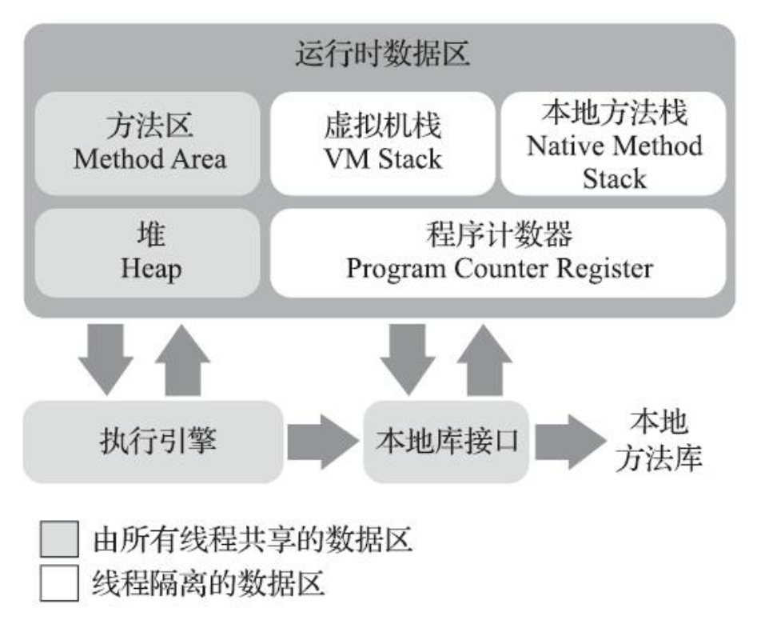
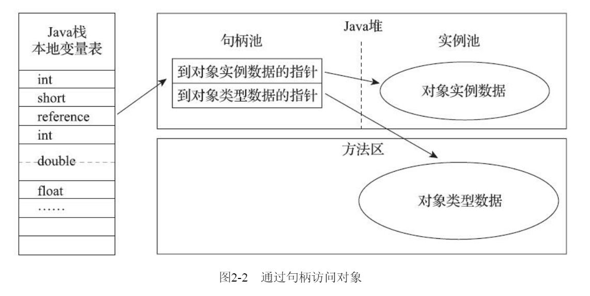
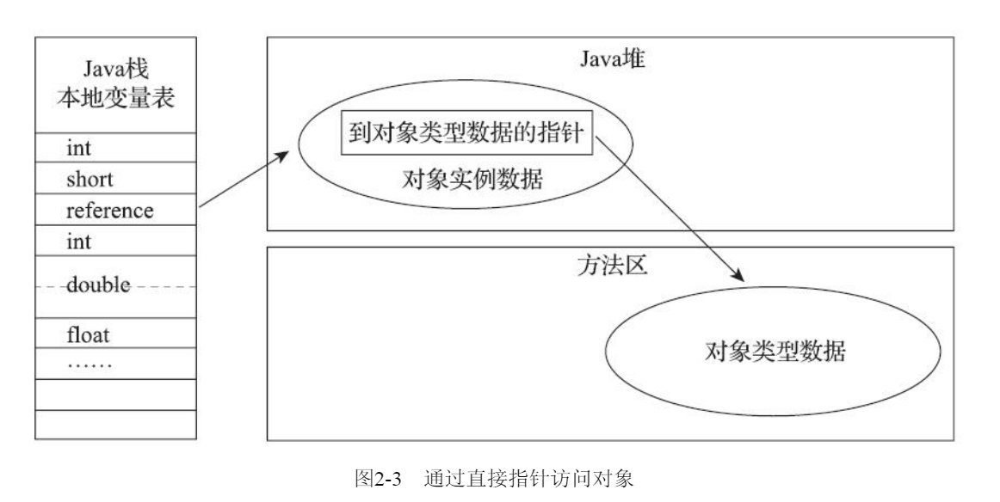

[TOC]

.java --javac--> .class(字节码，JAVA虚拟机执行的一种指令格式，相当于汇编语言) --JVM--> 机器码(解释器将字节码逐条翻译为机器码)

#### 运行时数据区(Run-Time Data Areas)

##### PC Register

* 一块较小的内存空间，当前线程执行字节码的行号指示器。
* 分支、循环、跳转、异常处理、线程恢复都依赖PC完成。
* 因为多线程的缘故，每个线程都有自己的PC。
* 如果是Native方法(在Java中定义接口规范，实现在其它语言中<C/C++>，绕过JVM，与底层硬件密切相关)，PC为undefined
* PC不会抛出OOM

##### Java Virtual Machine Stacks(虚拟机栈)
* 类比到C/C++，JVM Stack等同于Stack
* 与PC一样，也是线程私有，生命周期与线程相同
* 方法运行 ----> 创建栈帧 --用于--> 存储局部变量表、操作数栈、动态链接、方法出口
* 方法运行时会开辟一个栈帧(Stack Frame)
* **核心部分： 局部变量表**
    * 基本数据类型
    * 对象引用
    * returnAddress
 * 局部变量表存储空间的表现形式 ----> 局部变量槽(Slot)
 * 两类异常情况:
     * 线程请求的栈深度大于虚拟机允许的深度，抛出StackOverflowError
     * 如果Java虚拟机可以动态扩展(已分配的栈帧动态扩容)，当栈扩展时无法申请到足够的空间也会抛出OOM(OutOfMemoryError)(主流Hotspot虚拟机不可以)

##### Native Method Stack(本地方法栈)
本地方法栈是为本地方法服务

##### Heap (堆)
* 目标：只是为了分配对象实例，但并不是所有的对象实例都分配在堆上
* 所有线程共享这个堆内存空间
* 堆的内存分配在空间上可能不连续，但在逻辑上连续
* 如果堆分配的内存大于堆本身的大小，抛出OOM
* 堆也可以划分出线程私有的内存空间

##### 方法区(Method Area)
* 堆空间逻辑的一部分,Non-heap,但是可以不采取GC策略
* 存储了 run-time constant pool/field/method data/code for methods and constructors，**一些常量，类的相关信息，如类名、访问修饰符、常量池、字段描述、方法描述等**

###### 运行时常量池
* 属于方法区的一部分
* 来自于Class文件中的常量池表，存放**编译期生成**的字面量和符号引用
* 并非只有编译期常量可以进入常量池，运行期间也有可能

##### 注：直接内存
* 直接内存不是虚拟机运行时数据区的一部分
* NIO，基于Channel和缓冲区(Buffer)的IO方式
* 使用Native函数库直接分配堆外内存
* 该部分在动态扩容的时候也有可能抛出OOM异常

#### HotSpot虚拟机对象

##### 1. 对象的创建
1. 检查指令参数是否能在常量池中定位到一个类的符号引用，并且这个类是否被加载、解析和初始化

 1. 虚拟机为新生对象分配内存，使用以下哪种方法取决于堆内存是否规整，以及GC是否有空间压缩整理能力(Compact):
    * 指针碰撞：堆内存规整，空闲和非空闲内存以指针作为分界点指示器，分配内存即指针向空闲方向移动一段与对象大小相等的距离
    * 空闲列表：虚拟机维护一个列表，记录哪些内存块是可用的
2. 线程安全问题：首先给对象A分配内存，指针 **(指向堆空间的指针)** 还没来得及修改为指向对象A在堆中的位置，对象B也使用了原来的指针来分配内存，解决方法：
    * 分配内存空间的动作进行同步处理：CAS+失败重试 
    * TLAB(本地线程缓冲分配，Thread Local Allocation Buffer)：在线程的本地缓冲区进行分配，本地缓冲区用完了才进行同步锁定
3. 内存分配完成后，虚拟机将分配到的内存空间都初始化为0，保证对象的实例字段不经过初始化也可以使用
4. 其它一些必要设置
5. 在上述步骤完成之后，从虚拟机的视角来看，对象的创建已经完成，但是在Java程序的视角来看，.class文件中的<init>()方法还没有执行，对象的字段全为0，按照程序员的意愿执行<inint>()方法后，真正可用的对象才被构造出来

##### 2. 对象的内存布局
HotSpot中，对象在堆内的存储布局可以划分为三个部分：对象头(Header)、实例数据(Instance Data)、对齐填充(Padding)：

###### 对象头
两类信息：
* 存储对象自身的运行时数据，称为Mark Word，一般来说是32或64 Bitmap，但是实际设计中已经超过了这个范围，因而被设计为了一个 **动态定义的数据结构**

* 类型指针，指向类型元数据(Class)的指针，通过这个指针判断该对象属于哪个类

###### 实例数据
* 对象真正存储的有效信息，程序代码中定义的字段，包括父类继承和子类定义
* JVM分配顺序：
    * longs/doubles、ints、shorts/chars、bytes/booleans、oops（Ordinary Object Pointers，OOPs）,相同宽度被放在一起
    * 先父类后子类

###### 对齐填充
* 占位符
* 系统要求对象的起始地址需要是8字节的整数倍，因而对象在内存中的大小也需要是8字节的整数倍
* 对象头被刻意设计为了8字节的整数倍，如果对象实例数据部分没有对齐，此时就需要进行对齐填充

##### 3. 对象的访问定位
    
###### 对象访问的两种方式
**访问什么？** 对象类型数据 以及 对象实例数据
1. 句柄访问
    * Java堆中划分一块内存作为句柄池
    * 包含了对象 **实例数据** 和 **类型数据**，意即一个完整的对象被拆分为了两个部分，对象实例数据和对象类型数据
    * 好处：reference中只存**不变**的句柄地址，对象被移动时只会改变句柄中存储的指针
    
    
2. 直接指针访问
    * reference中直接存放对象地址，意即该reference直接指向一个对象地址
    * 这个对象地址所包含的内存空间可直接读取到对象实例数据，以及一个指向方法去对象类型数据的指针
    * 仅仅需要考虑如何放置访问**类型数据**的相关信息
    * 好处：快，因为对象访问在Java中非常频繁，节省了对象实例数据的指针定位开销
    * HotSpot VM 主要采取直接指针访问方式
    
    
 
